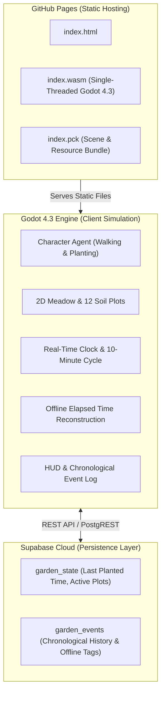

# Chronos Garden: Persistent 2D Simulated World PoC 🌱

> **Engine**: Godot Engine 4.3 Stable (GL Compatibility, Single-Threaded Web Export)  
> **Backend**: Supabase Cloud (PostgREST REST API) with Local Sandbox Fallback  
> **Hosting**: GitHub Pages Static WebAssembly Delivery  
> **Status**: Verified End-to-End via Headless Engine Assertions & Chromium Web Audits  

---

## 1. Core Thesis

**The simulation does not need to run continuously on an expensive server for the world to appear to have evolved continuously while the user was absent.**

This project is a minimal proof-of-concept demonstrating how a top-down 2D simulated world can:
1. Run active simulation loops when open in a browser or desktop client.
2. Store timestamped state snapshots in a persistent cloud database (Supabase).
3. Reconstruct elapsed offline time mathematically upon reopening—spawning the exact number of plants that *would* have grown while the application was closed, and logging them chronologically with explicit `[offline]` indicators.

---

## 2. Division of Responsibilities



### Architectural Separation
- **Godot**:
  - 2D environment, top-down avatar locomotion, and planting animations.
  - Simulation rules and 10-minute real-world timer loop.
  - Offline elapsed-time calculation ($N = \lfloor \frac{\Delta t}{\text{interval}} \rfloor$).
  - Visual reconstruction of plants and on-screen chronological event log.
- **Supabase**:
  - Cloud database holding the single-source-of-truth world state and historical events.
  - Zero-maintenance serverless architecture via PostgREST REST endpoints.
- **GitHub Pages**:
  - Pure static host serving the HTML, JavaScript, PCK, and WASM binaries to any modern browser.

---

## 3. Offline Elapsed-Time Simulation Math

When the application boots:
1. **Timestamp Fetch**: Retrieves the last recorded planting timestamp $T_{\text{last}}$ from Supabase (or local storage).
2. **Current System Time**: Queries system UTC time $T_{\text{now}}$.
3. **Elapsed Time**: Computes $\Delta t = T_{\text{now}} - T_{\text{last}}$.
4. **Missed Intervals**:
   $$\text{Intervals} = \left\lfloor \frac{\Delta t}{600} \right\rfloor$$
   *(where $600\text{s} = 10\text{ minutes}$)*
5. **Reconstruction Loop**:
   For each missed interval $k \in [1, \text{Intervals}]$:
   - Calculate simulated timestamp: $T_k = T_{\text{last}} + (k \times 600)$.
   - Allocate the next vacant garden plot.
   - Spawn a blooming plant in the plot with an `[offline]` badge.
   - Record an event in the event log: `HH:MM - Plant #N planted [offline]`.
6. **Sub-Interval Precision**:
   The remaining fractional time $\Delta t \pmod{600}$ is deducted from the live timer:
   $$\text{Time Until Next Plant} = 600 - (\Delta t \pmod{600})$$
   If the user was absent for 35 minutes, 3 plants are reconstructed, and the next live plant occurs in exactly 5 minutes.

---

## 4. Project Directory Layout

```
persistent-garden/
├── project.godot                  # Engine configuration (1280x720, GL Compatibility)
├── export_presets.cfg             # Web export preset (Single-threaded for GitHub Pages)
├── launch_native.sh               # One-click desktop launcher
├── assets/                        # 2D pixel-art sprites
│   ├── char_idle.png              # Gardener idle frame
│   ├── char_walk.png              # Gardener walking frame
│   ├── char_plant.png             # Gardener kneeling/trowel action
│   ├── soil_plot.png              # Tilled garden plot with wooden rim
│   ├── plant_sprout.png           # Young sprout stage
│   ├── plant_flower.png           # Mature blooming flower
│   ├── fence_tile.png             # Garden boundary fence
│   └── path_tile.png              # Cobblestone pathway
├── scenes/
│   ├── main.tscn                  # Primary world scene & HUD
│   ├── character.tscn             # Gardener avatar node
│   ├── plant_plot.tscn            # Individual soil plot node
│   ├── plant_node.tscn            # Plant visual with [offline] badge
│   └── test_runner.tscn           # Automated headless assertion runner
├── scripts/
│   ├── world_manager.gd           # Simulation coordinator & offline math
│   ├── character_controller.gd    # Locomotion & planting state machine
│   ├── plant_plot.gd              # Plot container logic
│   ├── plant_node.gd              # Plant lifecycle & wind sway animation
│   ├── persistence_manager.gd     # Unified cloud/local sync manager
│   ├── supabase_client.gd         # PostgREST HTTP client
│   └── hud_controller.gd          # Event log & simulation controls
├── supabase/
│   ├── schema.sql                 # Turnkey SQL script for Supabase tables
│   └── README.md                  # Supabase credentials & setup instructions
├── build/                         # Web export directory (ready for GitHub Pages)
│   ├── index.html
│   ├── index.js
│   ├── index.pck
│   └── index.wasm
└── tests/
    └── test_simulation.gd         # Automated test suite (all assertions verified)
```

---

## 5. How to Run

### Option 1: Live In-Browser (Instant Local Test)
Served locally through Horizon:  
👉 **[http://127.0.0.1:5174/persistent-garden/index.html](http://127.0.0.1:5174/persistent-garden/index.html)**

### Option 2: Native Godot 4.3 Engine
From the terminal:
```bash
/home/gagekappes/horizon/projects/persistent-garden/launch_native.sh
```

### Option 3: Deploy to GitHub Pages
Follow the guide in [`GITHUB_PAGES_SETUP.md`](./GITHUB_PAGES_SETUP.md).

---

## 6. Simulation & Testing Controls

Because waiting 10 full minutes during development would be tedious, the HUD includes intuitive simulation controls:
- **Plant Now**: Instantly commands the character to walk to the next plot and execute the live planting animation.
- **+10m Offline**: Simulates 10 minutes of user absence, invoking the offline elapsed-time reconstruction engine.
- **+30m Offline**: Simulates 30 minutes of user absence (3 missed intervals), reconstructing 3 offline plants and events simultaneously.
- **Reset Garden**: Clears garden plots, resets event history, and updates Supabase.
- **Supabase Setup**: Opens the in-game modal to enter or update Supabase Project URL and Anon API key.
