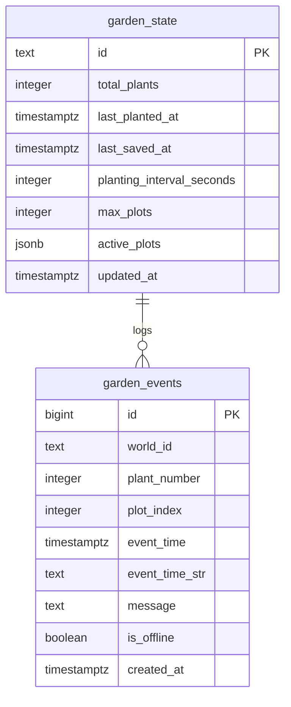

# Supabase Cloud Database Configuration

This directory contains the database schema required for the **Persistent Garden** 2D simulated world.

---

## Quick 3-Step Setup

### Step 1: Open Your Supabase Project
1. Log into your [Supabase Dashboard](https://supabase.com/dashboard).
2. Open your project (or create a free new project).

### Step 2: Run the SQL Schema
1. In the left navigation, click on **SQL Editor**.
2. Click **New query**.
3. Open [`schema.sql`](./schema.sql), copy its entire contents, paste them into the SQL editor, and click **Run**.
4. You will see confirmation that:
   - `public.garden_state` is created (stores world counters, timestamps, and plot occupancy).
   - `public.garden_events` is created (stores chronological event history).
   - Row Level Security (RLS) is enabled with open anonymous access policies.
   - Initial world record `main_garden` is inserted.

### Step 3: Copy Your Credentials
1. In Supabase, go to **Project Settings** (gear icon) -> **API**.
2. Copy two values:
   - **Project URL** (e.g. `https://your-ref.supabase.co`)
   - **anon / public key** (e.g. `eyJhbGciOi...` or `sb_publishable_...`)

---

## Connecting in the Application

### Option A: Using the In-Game UI
1. Launch the game (in your browser or native desktop).
2. Click the **Supabase Setup** button on the bottom toolbar.
3. Paste your **Project URL** and **Anon Key**.
4. Click **Save & Connect**.
5. The status badge will switch to `🟢 [Cloud: Supabase Active]`.

### Option B: Pre-configuring `config.json`
The game automatically checks `user://supabase_config.json`:
```json
{
  "supabase_url": "https://your-project.supabase.co",
  "supabase_anon_key": "your-anon-key-here"
}
```

---

## Schema Architecture


